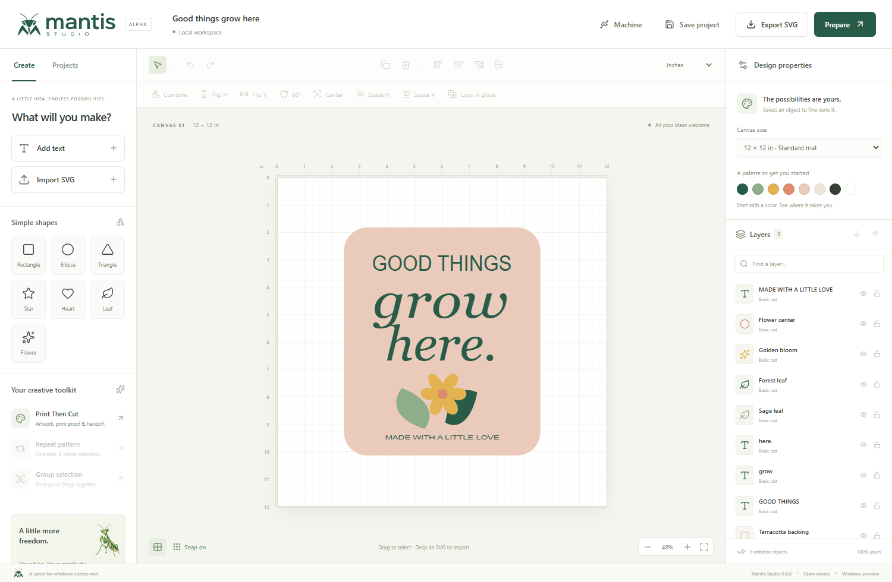
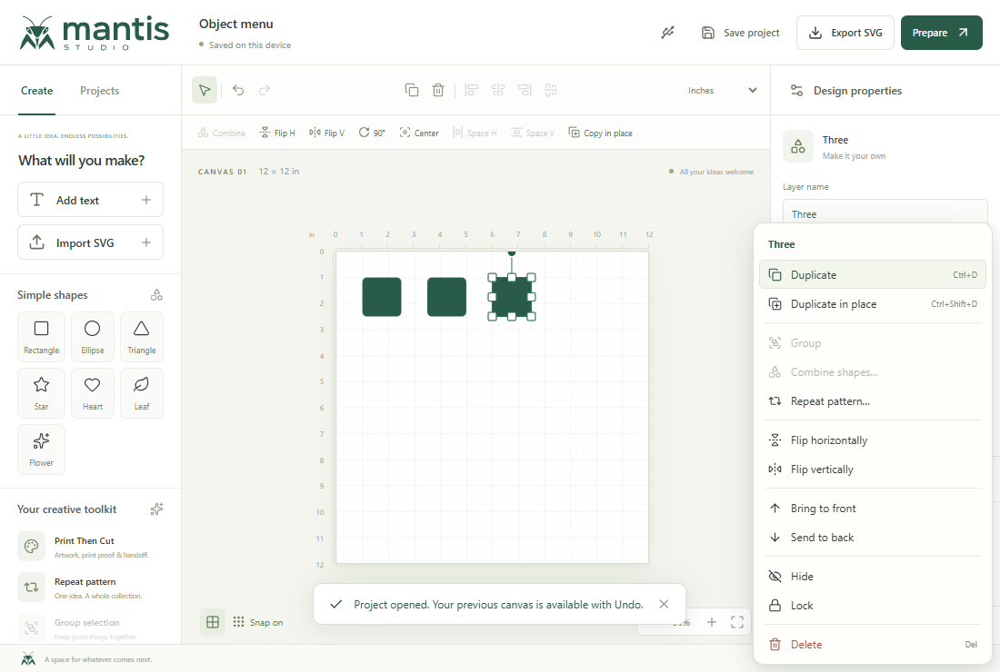
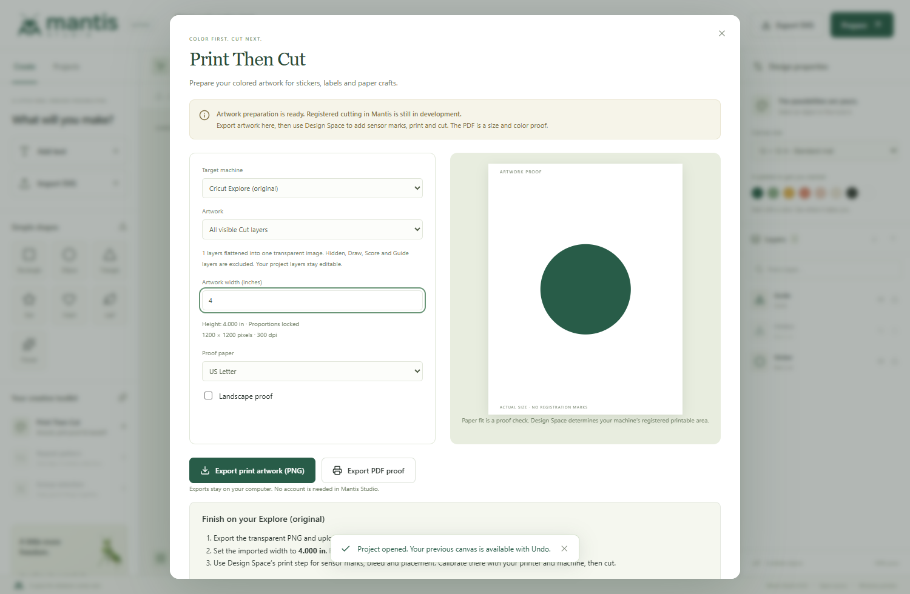

# Mantis Studio

**Your ideas, without limits.** An independent, open-source craft design studio for Windows, building toward an alternative workflow for Cricut users.

[](https://github.com/JFLXCLOUD/Mantis/actions/workflows/ci.yml)
[](LICENSE)

Design locally, keep editable project files, and take your artwork with you as SVG. Mantis has no account requirement, subscription, telemetry or cloud storage dependency. The interface, starter artwork and mantis identity are original.

**Development preview: public source, no downloadable release yet. Direct cutting is not available on any model.** The Explore 3 Bluetooth data link has been physically tested; the machine command protocol is still being researched. The first public application release is held until the [machine validation gates](docs/RELEASE_READINESS.md) pass.



## Create and edit

- **Precise transforms:** drag to resize freely or lock proportions, rotate, flip, align, distribute and repeat. Work in inches or millimeters with grid snapping.
- **Vector tools:** native shapes, editable text, Weld, Subtract, Intersect and Slice. Combine native shapes into editable paths with holes.
- **Fast object actions:** right-click the canvas or layers for duplicate, group, combine, repeat, arrange, hide, lock and delete. Keyboard navigation and undo are included.
- **Layers and local projects:** search layers, select matching colors, group artwork, recover your current workspace and save portable `.hopper` files.
- **Portable artwork:** sanitized SVG import, SVG export by canvas or group, mirrored material previews and overhang checks.
- **Print Then Cut preparation:** export transparent 300 dpi PNG artwork and Letter/A4 PDF proofs, then finish registration and cutting in Design Space. Native sensor registration is still planned.

<details>
<summary>See object editing and print preparation</summary>




</details>

Meet **Manti**, our praying mantis mascot, in the [brand kit](docs/BRANDING.md). Earlier Hopper projects and local workspaces remain compatible.

## Machine support: what works today

| Capability | Current status |
| --- | --- |
| Maker, Explore, Joy and Venture planning | 15 model profiles with transport and workflow guidance; a profile is not a cutting driver |
| Windows USB / Bluetooth discovery | Device metadata and pairing/radio diagnostics; BLE transport remains planned |
| Explore 3 Bluetooth connection | Physically verified RFCOMM data link, monitoring, connection cancellation and disconnect |
| Explore 3 startup research | Separate diagnostic reproduced one observed request/response; its meaning remains unverified |
| Machine configuration and job sending | Not implemented; Send cut job stays disabled |
| Motion, drawing, cutting and job stop/cancel | Not implemented or physically validated |
| Print Then Cut | Artwork/proof export works; native calibration, registration and cutting are pending |

Connection cancellation stops a connection attempt; it is **not a machine-motion stop**. `.hopperjob` exports are planning drafts, not executable machine jobs. See [model coverage](docs/MACHINE_SUPPORT.md), [device integration](docs/DEVICE_INTEGRATION.md) and the [Explore 3 investigation](docs/research/EXPLORE3_PROTOCOL.md) for the evidence and limits.

## Run from source on Windows

Use **Node.js 24 LTS (24.15 or newer within 24.x)** and Git. Development dependencies require an internet connection to install; the editor then runs locally.

```powershell
git clone https://github.com/JFLXCLOUD/Mantis.git
cd Mantis
npm ci
npm run build
npm start
```

For live development, run `npm run desktop:dev`. `npm run dev` opens a browser development server at `http://127.0.0.1:5173`; hardware discovery and connections require the Windows desktop app.

```powershell
npm test
npm run test:e2e
```

Browser tests use Microsoft Edge. Desktop tests use temporary profiles. Live hardware checks are opt-in and are excluded from CI; see [contributing](CONTRIBUTING.md). CI builds and tests the source without publishing installers or releases.

## Current editing limits

Imported SVG is one artwork layer. Scripts, external resources, embedded images, stylesheets and unsupported effects are removed; review imports visually. Text exports as SVG text and depends on installed fonts. Text and imports need outlining/decomposition before native shape-combining operations.

Prepare is an artwork review/export stage; automatic mat nesting and machine toolpaths are still planned. Operation labels are metadata, not commands understood automatically by other software. SVG output clips at the canvas boundary.

Autosave recovers the current workspace in each app/browser profile. Save `.hopper` files to keep separate projects and backups. Undo history is session-only (80 entries); projects support up to 1,000 objects and imports up to 5 MB. Details: [architecture and file formats](docs/ARCHITECTURE.md), [print workflow](docs/PRINT_THEN_CUT.md).

## Help build Mantis

Start with [contributing](CONTRIBUTING.md), the [roadmap](docs/ROADMAP.md) and [release readiness](docs/RELEASE_READINESS.md). Editing, accessibility, SVG interoperability, tests and documented observations of authorized hardware are useful contributions. Report reproducible problems through [GitHub Issues](https://github.com/JFLXCLOUD/Mantis/issues); use [private reporting](SECURITY.md) for vulnerabilities.

The renderer uses React, TypeScript and SVG. Electron provides an isolated desktop window and a restricted device bridge. Device research stays separate from the editor, with [recorded provenance](docs/INDEPENDENT_IMPLEMENTATION.md). We describe this as an independent implementation, not a formally separated clean-room process. [Validation notes](docs/VALIDATION.md) distinguish automated tests from physical observations.

## License and independence

Original code and bundled artwork are available under the [MIT license](LICENSE). Dependencies retain their own licenses; [third-party notices](THIRD_PARTY_NOTICES.txt) are included.

Mantis Studio is not affiliated with or endorsed by Cricut. Cricut, Design Space and machine names identify intended interoperability targets and belong to their respective owners. No proprietary Cricut code, artwork, keys or firmware is included.
